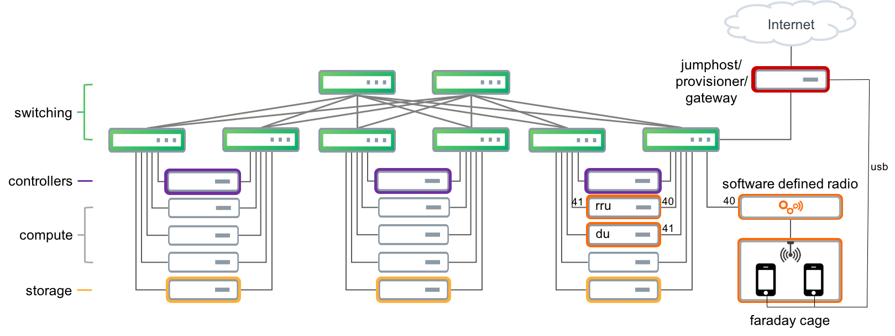

# Infrastructure Prep

This Ansible setup prepares network switching layer for the OPNFV use-case.  There is
a three rack configuration with dual leaf switches per each rack, two high speed
connnections to each server, and a dual spine for aggregation.  For the most part,
the leaf-server connections are 10G, and the leaf-spine connections are 100G.

The aggreagation is based on a BGP VXLAN-EVPN Layer 2 extentsion where all VLANs
are propagated for full fabric reachability.

The leaf-server connections are NOT connected as MLAG pairs, but rather, the OpenStack
deployment infrastructure expects all "OSP" vlans to be dropped on all interfaces
to the servers.  Then each server taps the VLANs they need on their uplink interfaces
to the leafs.  Individual servers use one of a few untagged "provisioning" VLANs that
are used for discovery and imaging.

There is a minor wrinkle to this in support of the Software Defined Radio and
signal processing components.  Each of these was designed to be attached to untagged
interfaces, so VLANs just plain mess them up.  To that end, we use VLANs to emulate
a directly cabled connection.

The figure below attempts to give you a flavor of the connectivity.

